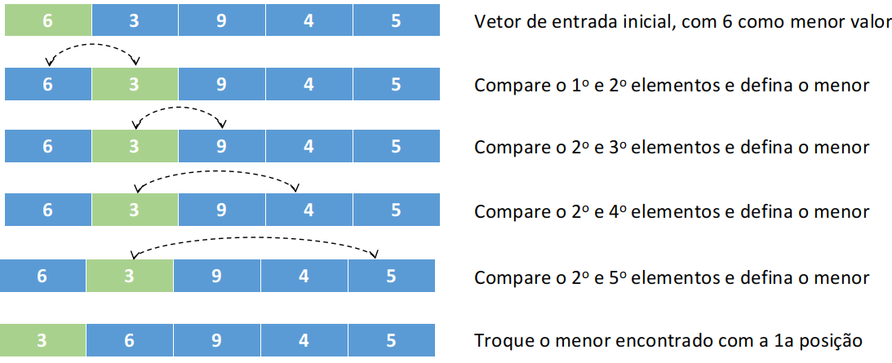

# Selection Sort: Implementação em C

 
 
 
 

 

 

O Selection Sort é um dos algoritmos de implementação simples existentes em literatura. Sua execução se resume em achar o menor (ou maior, caso decrescente) elemento de um conjunto e colocá-lo no início do vetor. Feito isso, avança-se uma posição no vetor e repete-se o passo da busca e permutação de elementos. Diferente do método <i>bubble sort</i>, no selection sort as permutações só são realizadas no final, o que implica em um custo de movimentação relativamente menor em comparação ao método da bolha. Vejamos um exemplo de sua forma de execução e custos envolvidos.

	 

Em termos de número de comparações ( <i>C(n)</i> ) e número de movimentos ( <i>M(n)</i> ), temos que o Selection Sort apresenta custo de O(n2) comparações e O(3n) movimentações, aproximadamente. De acordo com Knuth (1973, exercícios 5.2.3), o comando de atribuição dmin = j é executado aproximadamente n<i>log</i>n vezes, independente do modelo de entrada utilizado. Sendo assim, é possível afirmar que temos um algoritmo cujo tempo é linear e sem modificação atrelada à apresentação dos dados. Tem-se como vantagens de desvantagens em sua utilização:

> <b>Vantagens</b>: 
>
>(1) Apresenta custo linear, ou seja, não sofre modificação de tempo quanto a ordem inicial dos dados utilizados como entrada; (2) É um bom algoritmo para conjuntos de dados que apresentam registros muito grandes, ou seja, entradas com múltiplas colunas e; (3) é muito interessante quando a quantidade de registros de entrada é pequeno.

> <b>Desvantagens</b>: 
>
>(1) O fato da entradas estar parcialmente ou totalmente ordenada não contribui com o custo, logo, se paga O(n2) para qualquer situação de execução; (2) o algoritmo não é estável, uma vez que, verifica todos os elementos mesmo os maiores que o avaliado.

# Compilação e Execução

A lista dinâmica disponibilizada possui um arquivo Makefile que realiza todo o procedimento de compilação e execução. Para tanto, temos as seguintes diretrizes de execução:

| Comando                |  Função                                                                                           |                     
| -----------------------| ------------------------------------------------------------------------------------------------- |
|  `make clean`          | Apaga a última compilação realizada contida na pasta build                                        |
|  `make`                | Executa a compilação do programa utilizando o gcc, e o resultado vai para a pasta build           |
|  `make run`            | Executa o programa da pasta build após a realização da compilação                                 |

# Contatos

 

<a style="color:black" href="mailto:michel@cefetmg.br?subject=[GitHub]%20Source%20Dynamic%20Lists">
✉️ <i>michel@cefetmg.br</i>
</a>
